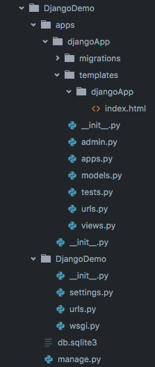

#Python - Django!
####Key Assignments
- Disappearing Ninjas and Ninja Gold

####MTV Recap
- Models handle DB interaction and tables `models.py`
- Templates handle client-facing HTML/CSS/JS `templates/appname/index.html`
- Views `views.py` handle the requests coming from the routing file `urls.py`

####Quiz
- A GET request to '/users' is fired...what's next?


####Session
- Session still does the same thing it always does regardless of what stack we're in.  
  - Hangs onto small amounts of data that we want to preserve for a current user, etc.
- How do we activate or gain access to session?
```
>python manage.py makemigrations
>python manage.py migrate
```
- Let's look at a `views.py` file and see where session lives.
  - In the `request` dictionary!
- We can update and check the session dictionary in a similar fashion as before, but now we just state it as `request.session['key']`
- But in our templates, we should only use dot notation `request.session.username`

####Forms
- With forms, we're still treating them the same way.  We either have POST information or GET information, but the difference in Django is that we get to use the `request` dictionary again to check for different methods.
  - Need to check out what's inside a POST? `request.POST` has it.
  - Need to check out what's inside a GET? `request.GET` has it.
  - `request` is a one-stop shop
- <b>Notable difference in forms themselves...</b>
  - We need a <b>CSRF</b> token.  This is an added layer of security for our forms.  If the CSRF token is unrecognized, then Django won't accept it.
```
<form action="/users" method="post">
  
  Name: <input type="text" name="name" />
  <input type="submit" value="Submit" />
</form>
```

####Throwing Data Into Templates
- Context Objects (just plain old dictionaries)

```python
def show(request):
  context = {'user': 'Happy Gilmore'}
  return render(request, '/myApp/show.html', context)
```

```html
<h1>{{user}}: Somebody's closer!</h1>
```
