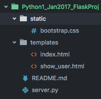

#Python Flask Week - Part 3
####Final Touches on Flask
- Static Files
- Validations
- Advanced Routing

####Static Files
A static folder is usually good for stashing your CSS and JS files.



Okay, but how do we access them? Flask has our back ...
```html
<!DOCTYPE html>
<html>
  <head>
    <title>Title</title>
    <link rel="stylesheet" href="{{url_for('static', filename='bootstrap.css')}}">
  </head>

</html>
```
####Why Validate?
We need to validate form data because there are malicious threats out there
  - Malicious SQL statements

<b>Note</b>: When we validate, we have to tell our users or else we have a bad UX

####How Do We Validate?
- We can check lengths of inputs for presence

  ```python
  if len("some_string") is 0: #what would we replace "some_string" with?
  ```

- We can check regular expressions for validating emails

  ```python
  from flask import Flask, render_template, #....
  import re
  EMAIL_REGEX = re.compile(r'^[a-zA-Z0-9\.\+_-]+@[a-zA-Z0-9\._-]+\.[a-zA-Z]*$')

  app = Flask(__name__)
  app.secret_key = "ThisIsSecret!"

  @app.route('/process', methods=["POST"])
  def process():
    if not EMAIL_REGEX.match(request.form['email']):
      #we've got a bad email
  ```

- We can do basic conditional statements in combination with flash

  ```python
  from flask import Flask, render_template, #....
  import re
  EMAIL_REGEX = re.compile(r'^[a-zA-Z0-9\.\+_-]+@[a-zA-Z0-9\._-]+\.[a-zA-Z]*$')

  app = Flask(__name__)
  app.secret_key = "ThisIsSecret!"

  @app.route('/process', methods=["POST"])
  def process():
    if not EMAIL_REGEX.match(request.form['email']):
      #we've got a bad email
      flash('email is poorly formatted')
  ```
- We can worry about encryption checks later

####Advanced Routing?
- How else can we pass information? Through the route itself!
```python
@app.route('/users/<user_id>')
def show(user_id):
  return render_template('show.html', id=user_id)
```

```html
<!DOCTYPE html>
<html>
  <head>
    <meta charset="utf-8">
    <title></title>
  </head>
  <body>
    <table>
      <tr>
        <td><a href="/users/1">User 1</a></td>
        <td><a href="/users/2">User 2</a></td>
        <td><a href="/users/3">User 3</a></td>
      </tr>
    </table>
  </body>
</html>
```
