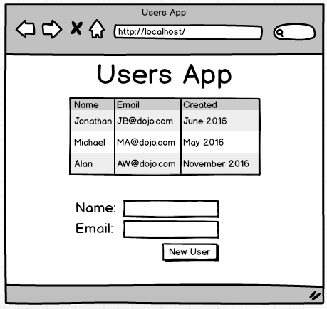

#Python - Flask + MySQL Week ( THE WALL WEEK )
####Lemo - Day 1 of UsersApp

####Activity - Continue Building the Users App
Add the feature to add a User

####RESTful routing
- A convention for naming your routes so that we can understand them just by reading them
- E.G.
  - A GET request to `/users` suggests the INDEX method will return an HTML page about Users
  - A GET request to `/users/1` suggests the SHOW method will return an HTML page about a specific User (id = 1)
  - A GET request to `/users/new` suggests the NEW method will return an HTML page with a form that let's us create a new User
  - A POST request to `/users` suggests the CREATE method will take a form (coming from /users/new) that will let us INSERT a new User into our DB
  - A GET request to `/users/1/edit` suggests the EDIT method will return an HTML page with a form that's specific to a user that will let us edit that one user
  - A POST request to `/users/1` suggests the UPDATE method will take a form (coming from /users/1/edit) that will let us UPDATE a user in our DB
  - A POST request to `/users/1/delete` or `/users/1/destroy` suggests the DESTROY method will take a form (coming from /users/1/edit or somewhere else) and DELETE that user in our DB
