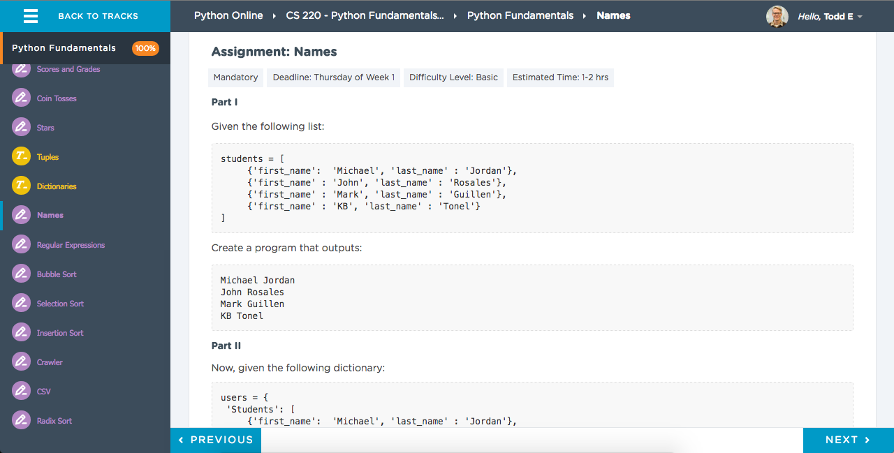

#Python Fundamentals Lecture 2

####More Administrative Work
- What Do The Belt Exams Mean?
- New Slack Team and Channel
  - Get the Slack Desktop App! It Makes Everything Better
  - Manage multiple team accounts
  - Still have access to the WebFun chatter
  - Python-centric Talk with the new Team/Channel

####Key Assignment This Week
- <b>Names</b>

####Functions, Dictionaries, Tuples
- Functions
  - What are they good for?
- Dictionaries
  - What are they good for?
- Tuples
  - What are they good for?
